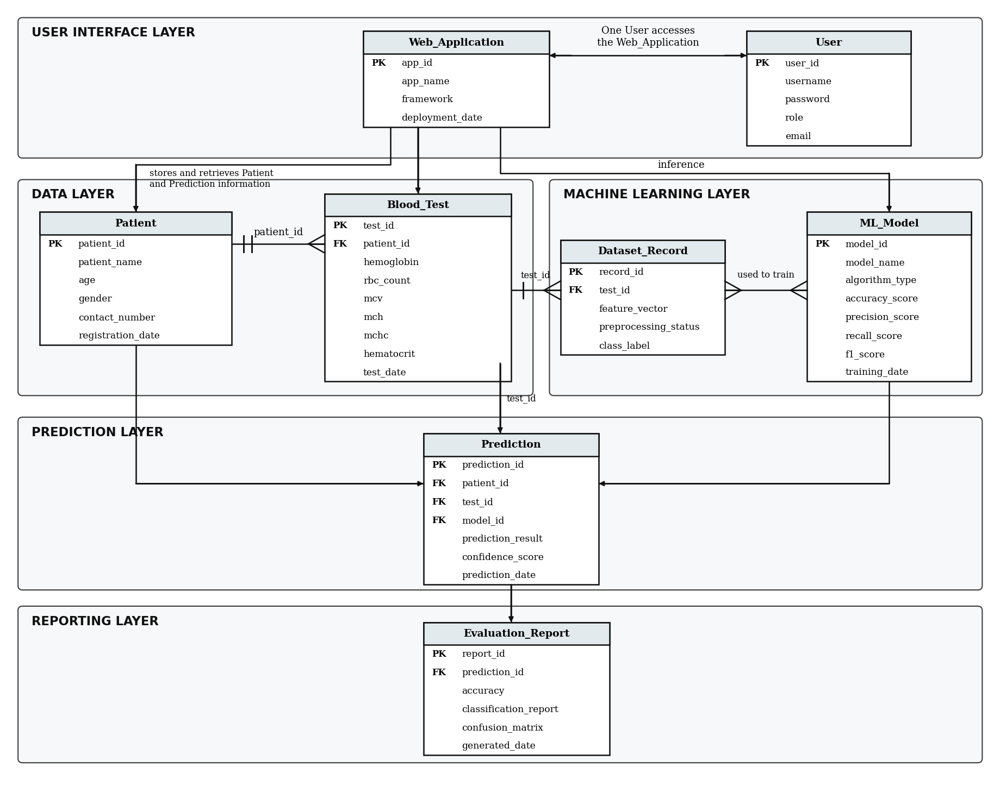

# AnemiaSense

Flask + scikit-learn web app that screens for anemia from blood test values, gives a
Low/Moderate/High risk level with guidance, and tracks a patient's follow-up results.

**Demo:** https://anemiasense-xw9q.onrender.com

**Note:** trained on synthetic data; a screening aid, not a diagnosis.

## Run locally
```
python -m venv venv
venv\Scripts\activate        # macOS/Linux: source venv/bin/activate
pip install -r requirements.txt
python train_model.py
python app.py
```
Open http://127.0.0.1:5000

## API
```
curl -X POST http://127.0.0.1:5000/api/assess -H "Content-Type: application/json" \
  -d '{"age":30,"sex":"female","hemoglobin":9.5,"rbc":3.6,"hematocrit":29,"patient_id":"P-1"}'
```

## Structure
`app.py` (routes, validation, SQLite history) · `train_model.py` (data, training, report plot) ·
`features.py` (shared indices) · `templates/`, `static/` · `Procfile` (deployment)

## Database design
The SQLite schema follows the ER diagram in `docs/AnemiaSense_ERD.png` (layers: user interface, data,
machine learning, prediction, reporting).



Each assessment with a Patient ID saves a `patients` row, a `blood_tests` row, a `dataset_records` row,
a `predictions` row (linked to the `ml_models` row registered from `models/metrics.json`) and an
`evaluation_reports` row. `users` and `model_training_records` exist in the schema but are not used yet
(no login, and the model is trained on synthetic data).
